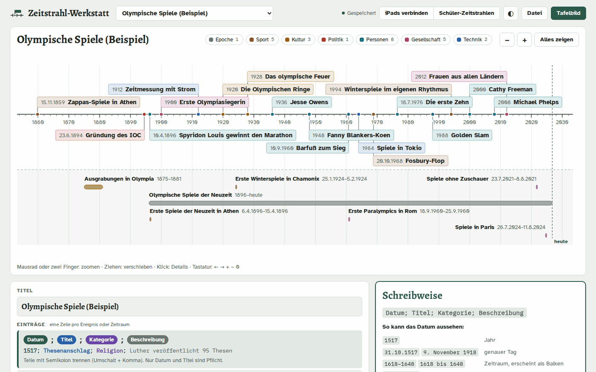
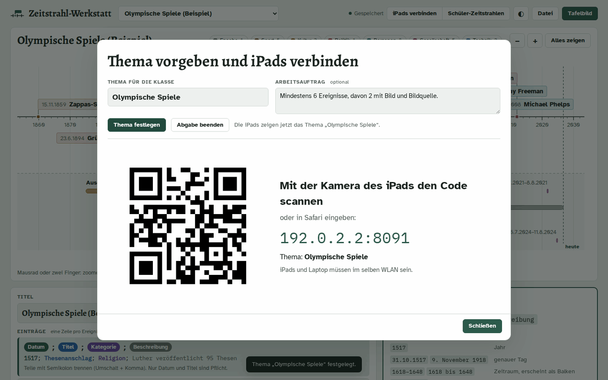
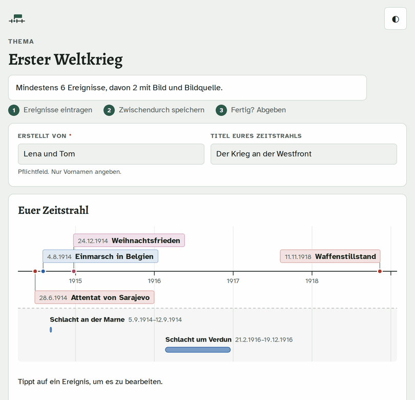
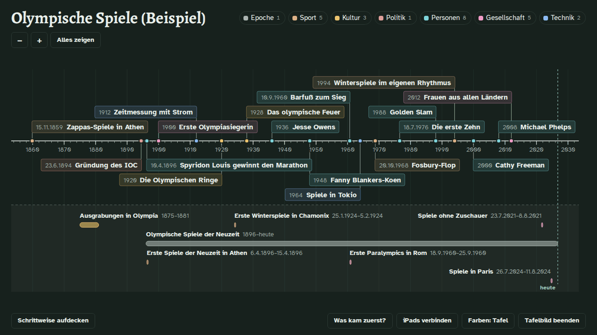
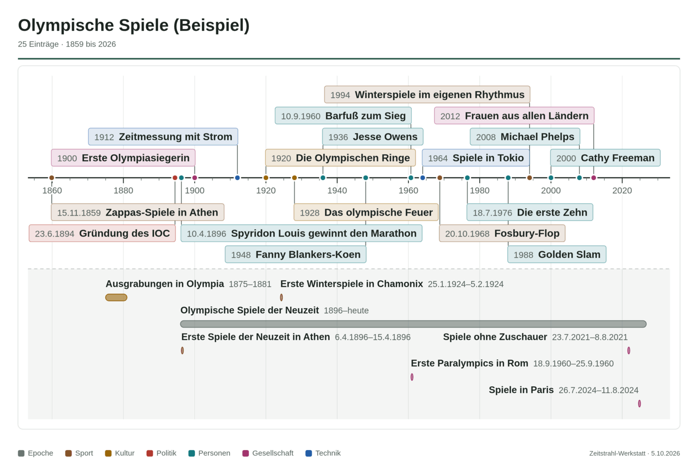
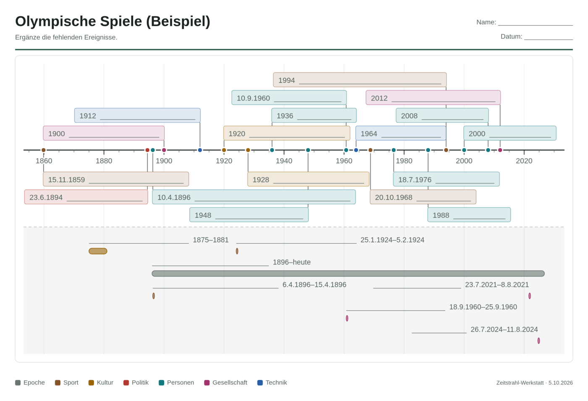

# Zeitstrahl-Werkstatt

Interaktive Zeitstrahlen für Geschichte und Religion. Die Lehrkraft pflegt eigene Zeitstrahlen als einfachen Text, zeigt sie als Tafelbild am Beamer und sichert sie als Bild fürs Arbeitsblatt. Schülerinnen und Schüler bauen auf dem iPad zu einem vorgegebenen Thema eigene Zeitstrahlen mit Fotos und geben sie ab. Die Lehrkraft präsentiert anschließend die Zeitstrahlen der Gruppen nacheinander.

Der Laptop der Lehrkraft ist dabei der Server. Es gibt keine Cloud und keine Konten, alle Daten bleiben auf dem Laptop.



## Einrichten (einmalig)

1. **Node.js installieren:** Von https://nodejs.org die Version „LTS“ herunterladen und installieren. Das Programm ist kostenlos, weitere Pakete braucht die Werkstatt nicht.
2. **Projekt herunterladen:** Auf GitHub über **Code → Download ZIP** herunterladen und auf dem Laptop entpacken, z. B. in „Dokumente“.

## Im Unterricht

1. **Server starten:** Im Ordner doppelklicken auf
   - Windows: `starten-windows.bat`
   - Mac: `starten-mac.command` (beim ersten Mal: Rechtsklick → Öffnen)
   - Linux: `starten-linux.sh` (je nach Dateimanager „Als Programm ausführen“ wählen)

   Oder in der Konsole (Eingabeaufforderung, Terminal) im Werkstatt-Ordner eintippen, das ist auf allen Systemen gleich:

   ```
   node server.js
   ```

   `npm start` funktioniert genauso.

   Es öffnet sich ein Fenster mit den Adressen, und der Browser zeigt die Lehrkraft-Ansicht unter `http://localhost:8080`. **Das Fenster während der Stunde offen lassen.**
2. **Thema vorgeben:** Auf **iPads verbinden** klicken, das Thema eintragen (z. B. „Reformation“), auf Wunsch einen kurzen Arbeitsauftrag und bis zu acht Kategorien (z. B. „Personen, Religion, Politik“), dann **Thema festlegen** klicken. Kategorien lassen sich später ergänzen, die iPads übernehmen sie nach spätestens 20 Sekunden. Darunter erscheint ein großer QR-Code für den Beamer.
3. **iPads verbinden:** Die Schülerinnen und Schüler scannen den QR-Code mit der Kamera-App und landen auf der Schülerseite. Dort stehen schon das Thema und der Arbeitsauftrag.
4. **Zeitstrahl bauen:** Jede Gruppe trägt ihre Vornamen und auf Wunsch einen Titel ein und legt dann Ereignisse an: Datum, Ereignis, Kategorie, Beschreibung und ein Foto (direkt fotografiert oder aus der Mediathek, die Bildquelle ist dann Pflicht). Hat die Lehrkraft Kategorien vorgegeben, tippt die Gruppe eine davon an, statt selbst eine einzutragen. Das Formular zeigt sofort, wie das Datum verstanden wurde („Erkannt: 24. Oktober 1648 · vor 378 Jahren“). Der eigene Zeitstrahl wächst oben live mit; Antippen eines Ereignisses öffnet es zum Bearbeiten.

    

5. **Zwischenspeichern:** Beim ersten **Zwischenspeichern** bekommt die Gruppe einen **Code** aus fünf Zeichen (z. B. `K7M2X`), den sie aufschreibt. Danach speichert die Seite alle 15 Sekunden automatisch. In der nächsten Stunde, auch auf einem anderen iPad, tippt die Gruppe den Code unter „Mit eurem Code weiterarbeiten“ ein und macht weiter.
6. **Abgeben:** Ist der Zeitstrahl fertig, tippt die Gruppe auf **Fertig – abgeben**. Verbessern und erneut abgeben geht jederzeit. Fällt das WLAN aus, sagt die Seite das deutlich; die Eingaben bleiben auf dem iPad und werden gespeichert, sobald die Verbindung wieder da ist. Eine Rückmeldung der Lehrkraft erscheint oben auf der Seite.
7. **Abgabe beenden:** Vor dem Präsentieren unter **iPads verbinden** auf **Abgabe beenden** klicken. Dann kann keine Gruppe mehr speichern, und auf den iPads steht, dass die Abgabe beendet ist. **Bearbeiten wieder erlauben** hebt das auf.
8. **Rückmeldung geben:** In der Übersicht **Schüler-Zeitstrahlen** hat jede Gruppe einen Knopf **Rückmeldung**. Der Text erscheint auf dem iPad der Gruppe, sobald sie mit ihrem Code arbeitet, spätestens nach wenigen Sekunden.
9. **Abgaben ansehen:** Bei der Lehrkraft zählt der Knopf **Schüler-Zeitstrahlen** die Abgaben mit, neue Abgaben werden kurz angezeigt. Die Übersicht zeigt je Gruppe den Stand („in Arbeit“ oder „abgegeben“) und den Code, falls eine Gruppe ihn vergessen hat. Alle Zeitstrahlen stehen außerdem oben in der Auswahlliste unter „Schüler: Reformation“. Ist ein Schüler-Zeitstrahl ausgewählt, zeigt die rechte Spalte das Thema, den Arbeitsauftrag und alle Gruppen dazu, per Klick wechselt man zur nächsten Gruppe.
10. **Eigenen Zeitstrahl zeigen:** Unter **iPads verbinden** bei **Zeitstrahl für die Schüler sichtbar** einen eigenen Zeitstrahl wählen, z. B. eine Musterlösung. Auf den iPads erscheint nach spätestens 20 Sekunden die Karte **Zeitstrahl eurer Lehrkraft**. Die Gruppen können ihn ansehen, Ereignisse antippen, ihn drucken oder als PDF und als Bild speichern. Ihr eigener Zeitstrahl bleibt dabei unverändert. Änderungen der Lehrkraft erscheinen von selbst, mit **keiner** verschwindet die Karte wieder.
10. **Präsentieren:** Einen Schüler-Zeitstrahl auswählen und **Tafelbild** klicken. Mit **Nächster Zeitstrahl** (oder „Bild ab“ am Presenter) geht es zur nächsten Gruppe desselben Themas. **Schrittweise aufdecken** funktioniert für jeden Zeitstrahl. **Was kam zuerst?** mischt die Ereignisse des gezeigten Zeitstrahls; die Klasse bringt sie an der Tafel in die richtige Reihenfolge, **Prüfen** zeigt, was schon stimmt.

    

11. **Behalten:** Mit **In meine Zeitstrahlen kopieren** wird eine Schülerarbeit zu einem eigenen, bearbeitbaren Zeitstrahl. **Abgabe löschen** verschiebt sie ins Archiv. Ist die Schülerseite dazu noch offen, speichert sie nicht einfach weiter: Die Gruppe sieht, dass die Lehrkraft den Zeitstrahl gelöscht hat, und kann ihn auf Wunsch als neuen Zeitstrahl mit neuem Code speichern.
12. **Beenden:** Das Server-Fenster schließen.

### Tafelbild am Lehrer-PC, wenn der Laptop nicht am Beamer hängt

Hängt nur der Lehrer-PC am Beamer oder Smartboard, öffnet man dort dieselbe Lehrkraft-Ansicht wie am Laptop. Der Server läuft weiter auf dem Laptop, beide Geräte müssen im selben Netz sein.

1. **Passwort festlegen:** Beim ersten Start fragt das Server-Fenster nach einem Passwort (mindestens 6 Zeichen, zweimal eingeben, die Eingabe bleibt unsichtbar). Nur Enter heißt: kein Passwort, die Lehrkraft-Ansicht geht dann nur am Laptop. Weil die Verbindung im Schulnetz unverschlüsselt ist, ein Passwort nehmen, das sonst nirgends benutzt wird. Festlegen, ändern oder entfernen geht jederzeit mit

   ```
   node server.js --passwort
   ```

   Das klappt auch per SSH auf einem Server ohne Bildschirm, z. B. `node server.js --passwort --kein-browser`.
2. **Am Lehrer-PC:** Im Browser die Adresse eingeben, z. B. `http://192.168.178.23:8080/lehrkraft`, und mit dem Passwort anmelden. Die Adresse steht im Server-Fenster und am Laptop unter **Datei → Am Lehrer-PC öffnen …**.
3. Dort geht alles wie am Laptop: Tafelbild, iPads verbinden mit QR-Code, Thema vorgeben, Schüler-Zeitstrahlen, Bearbeiten. Zum Schluss oben auf **Abmelden** klicken.

Gespeichert wird immer auf dem Laptop im Ordner `daten`, auf dem Lehrer-PC bleibt nichts liegen. Änderungen an einem Gerät erscheinen nach wenigen Sekunden auf dem anderen. Ändern beide gleichzeitig, gilt die zuerst gespeicherte Änderung, und das andere Gerät sagt Bescheid. Welcher Zeitstrahl gerade gezeigt wird, merkt sich jedes Gerät selbst: Ein Wechsel am Laptop schaltet das Tafelbild am Lehrer-PC nicht um.

Nach einem Neustart des Servers oder nach zwölf Stunden meldet man sich am Lehrer-PC neu an. Läuft der Server ohne Konsole, etwa als Dienst, fragt er nicht nach dem Passwort. Dann einmal im Terminal `node server.js --passwort` ausführen.

### Wenn die iPads die Seite nicht erreichen

- Laptop und iPads müssen im **selben WLAN** sein.
- **Windows** fragt beim ersten Start, ob Node.js im Netzwerk kommunizieren darf. Dann „Private Netzwerke“ erlauben. Bei einem Schul-WLAN, das Windows als „öffentlich“ einstuft, muss auch „Öffentliche Netzwerke“ erlaubt werden.
- Viele Schul-WLANs verbieten Verbindungen zwischen Geräten („Client-Isolation“). Dann hilft ein eigenes WLAN, z. B. ein Hotspot vom Diensthandy, mit dem sich Laptop und iPads verbinden. Alternativ kann die IT-Betreuung den Laptop freischalten.
- Zeigt der Dialog mehrere Adressen, die anderen nacheinander ausprobieren.
- Die Adresse lässt sich auch in Safari eintippen, z. B. `192.168.178.23:8080`.

### Port ändern

Die Werkstatt nutzt standardmäßig Port **8080**. Ist er belegt oder soll ein anderer genutzt werden, in der Datei `einstellungen.txt` im Werkstatt-Ordner die Zeile ändern, z. B.:

```
port = 8090
```

Danach das Server-Fenster schließen und neu starten. Die neue Adresse steht im Server-Fenster und im QR-Code. `einstellungen.txt` legt der Server beim ersten Start mit Erklärungen an. Darin steht auch das Passwort für den Lehrer-PC, nur als Hash. Die Datei ist nicht im Repository, ein Update überschreibt sie also nie. Für einen einzelnen Start geht es auch ohne die Datei: `node server.js 8090`.

Bei Port **80** brauchen die iPads gar keine Portnummer (`192.168.178.23` genügt). Auf Mac und Linux braucht Port 80 allerdings Administratorrechte.

Der Browser merkt sich Daten getrennt je Port. Nach einem Wechsel holt die Lehrkraft-Ansicht die Zeitstrahlen deshalb automatisch aus `daten/zeitstrahlen/` zurück.

## Ohne Server

`index.html` funktioniert auch per Doppelklick, ganz ohne Server, z. B. zum Vorbereiten zu Hause. Dann fehlen nur „iPads verbinden“ und die Schüler-Zeitstrahlen. Auch die Schülerseite `beitrag.html` läuft per Doppelklick: Dort tragen die Schüler das Thema selbst ein und speichern ihren Zeitstrahl als Datei. Mit **Datei öffnen und weiterarbeiten** machen sie in der nächsten Stunde dort weiter. Die Lehrkraft liest die Datei über **Datei → Öffnen** ein.

**Wichtig:** Der Browser speichert die Zeitstrahlen getrennt nach Adresse. Was unter `http://localhost:8080` angelegt wurde, erscheint nicht beim Doppelklick auf `index.html` und umgekehrt. Zum Übertragen **Datei → Alle Zeitstrahlen sichern** und auf der anderen Seite **Datei → Öffnen** verwenden.

## Sichern, weitergeben, einlesen

- **Mit Server** liegt jeder Zeitstrahl zusätzlich als eigene Datei in `daten/zeitstrahlen/`, benannt nach seinem Titel (z. B. `weimarer-republik.json`). Jede Datei lässt sich über **Datei → Öffnen** einlesen oder weitergeben. Gelöschte Zeitstrahlen wandern nach `daten/zeitstrahlen/geloescht/`. Vor der ersten Änderung eines Tages legt der Server den bisherigen Stand als Tageskopie in einem Ordner wie `daten/sicherungen/2026-10-05/` ab, die letzten 14 bleiben liegen. Es gilt nur der Ordner `daten`: Ist er leer, etwa nach einem neuen Download, startet die Lehrkraft-Ansicht leer, auch wenn der Browser noch Zeitstrahlen von früher kennt.
- **Alles auf einmal sichern**, auch die Schülerarbeiten: den Ordner `daten` kopieren, z. B. auf einen USB-Stick.
- **Ohne Server** liegt alles nur im Browser. Die Werkstatt bittet den Browser, die Daten dauerhaft zu behalten. Gab es seit sieben Tagen Änderungen ohne Sicherung als Datei, erscheint oben **Jetzt sichern**.
- **Alle Zeitstrahlen sichern** speichert eine ZIP-Datei, darin je Zeitstrahl eine eigene .json-Datei mit Bildern. Beim Öffnen einer solchen Sicherung (oder einer .json-Datei mit mehreren Zeitstrahlen) fragt die Werkstatt: **Hinzufügen** legt nur fehlende Zeitstrahlen an, **Ersetzen** stellt genau den Stand der Sicherung her.
- **Mit Bildern sichern** speichert nur den gerade gezeigten Zeitstrahl, zum Weitergeben an Kolleginnen und Kollegen.
- **Tabellen** aus Excel, Numbers oder LibreOffice lassen sich als .csv öffnen. Eine Zeile pro Ereignis, die Spalten Datum, Titel, Kategorie und Beschreibung. Mit Kopfzeile dürfen die Spalten in beliebiger Reihenfolge stehen.
- Öffnet man denselben Zeitstrahl ein zweites Mal, wird er nicht doppelt angelegt.

## Funktionen

| Bereich | Was es kann |
| --- | --- |
| Zeitstrahl | Zoomen (Mausrad, zwei Finger, `+` `−`), Verschieben (Ziehen, `←` `→`), „Alles zeigen“ (`0`). Ereignisse als Fähnchen, Zeiträume als Balken, Linie für „heute“. |
| Kategorien | Farbig, per Klick ein- und ausblendbar. Auf Wunsch gibt die Lehrkraft beim Thema bis zu acht vor, dann tippen die iPads nur noch eine davon an. |
| Details | Klick auf einen Eintrag zeigt Datum, „vor … Jahren“, Dauer, Beschreibung, Bild, Verfasser und Bildquelle. Bilder lassen sich dort auch selbst hinzufügen. |
| Tafelbild | Vollbild für den Beamer, große Schrift. **Schrittweise aufdecken** blättert in zeitlicher Reihenfolge (Pfeiltasten, Leertaste oder Presenter). |
| Farben | Automatisch, hell oder „Tafel“ (dunkel mit Kreidefarben), umschaltbar über den Knopf ◐ neben „Datei“ und im Tafelbild. |
| Arbeitsblatt | Sichtbaren Ausschnitt als PNG sichern oder über **Datei → Zeitstrahl drucken** direkt auf A4 quer drucken. Bild und Druck sehen gleich aus: Kopf mit Titel, Rahmen, Kategorien und Datum. Das **Lückenbild** zeigt an denselben Stellen nur die Daten mit Leerzeilen zum Ausfüllen, so passt das Bild als Lösung dazu. Auch die Schüler sichern ihren eigenen Zeitstrahl auf der Schülerseite als Bild oder drucken ihn (auf dem iPad im Druckfenster auch als PDF). |
| Übung | **Was kam zuerst?** im Tafelbild: Die Ereignisse stehen gemischt, die Klasse sortiert sie per Pfeil oder Ziehen, **Prüfen** und **Lösung zeigen** helfen weiter. |
| Schüler-Zeitstrahlen | Thema und Arbeitsauftrag vorgeben, Abgabe beenden, je Gruppe eine Rückmeldung schreiben, Abgaben mit Stand und Code im Überblick, im Tafelbild nacheinander zeigen, in eigene Zeitstrahlen kopieren. |
| Speichern | Automatisch im Browser und, wenn der Server läuft, zusätzlich je Zeitstrahl als Datei in `daten/zeitstrahlen/` mit Tageskopien. Alle sichern als ZIP. Einlesen von .txt, .json, .csv und .zip. |

Fürs Arbeitsblatt: links das gesicherte Bild, rechts das Lückenbild. Das Lückenbild hat dieselbe Anordnung, statt der Titel stehen dort Linien, und oben ist Platz für Name und Datum. Ausgedruckt sehen beide genauso aus wie hier.

 

## Schreibweise der Einträge

Eine Zeile pro Eintrag:

```
Datum; Titel; Kategorie; Beschreibung
```

Getrennt wird mit dem Semikolon. Weitere Semikolons gehören zur Beschreibung.

| Datum | Bedeutung |
| --- | --- |
| `1517` | Jahr |
| `31.10.1517` oder `9. November 1918` | genauer Tag |
| `September 1522` | Monat |
| `1618–1648`, `1618-1648` oder `1618 bis 1648` | Zeitraum (Balken) |
| `15. Jh.`, `15. Jahrhundert`, `frühes 16. Jh.` oder `14.–16. Jh.` | Jahrhundert als Zeitraum (1401–1500) |
| `44 v. Chr.` | vor Christus. Ein Jahr 0 gibt es nicht. |
| `7–4 v. Chr.` | Zeitraum vor Christus |
| `um 1450` oder `ca. 1450` | ungefähre Angabe |
| `1949–heute` | bis zum heutigen Tag |
| `# Notiz` | Kommentar, erscheint nicht im Zeitstrahl |

Feste Farben haben die Kategorien Politik, Religion, Kultur, Technik, Wirtschaft, Gesellschaft, Personen und Epoche. Eigene Kategorien bekommen automatisch eine freie Farbe. Vorgegebene Kategorien haben in allen Gruppen-Zeitstrahlen und im Tafelbild dieselbe Farbe. Neue Kategorien hängt man am besten hinten an, dann behalten die bisherigen ihre Farben.

Übernommene Schülerbeiträge tragen Zusatzangaben in geschweiften Klammern: `{von:Lena}` `{quelle:Wikimedia Commons}` `{bild:b1k9x}`.

## Datenschutz

- **Keine Cloud, keine Konten:** Der Server läuft nur auf dem Laptop und nur, solange das Fenster offen ist.
- **Daten im Ordner `daten/`:**
  - `aufgabe.json`: das aktuelle Thema, der Arbeitsauftrag, die vorgegebenen Kategorien, ob die Abgabe beendet ist und welcher Zeitstrahl der Lehrkraft für die iPads sichtbar ist
  - `abgaben/`: die Zeitstrahlen der Schülerinnen und Schüler, je Gruppe eine Datei wie `reformation-lena-und-tom-K7M2X.json` (Thema, Vornamen, Code, Rückmeldung der Lehrkraft)
  - `archiv/`: gelöschte Abgaben
  - `zeitstrahlen/`: die Zeitstrahlen der Lehrkraft, je Zeitstrahl eine Datei, gelöschte in `zeitstrahlen/geloescht/`
  - `sicherungen/`: je Tag eine Kopie davon, die letzten 14

  Nach Abschluss einer Unterrichtseinheit können `abgaben/` und `archiv/` gelöscht werden.
- **Nur Vornamen:** Die Schülerseite fragt ausschließlich nach Vornamen.
- **Getrennte Zugänge:** Lehrkraft-Ansicht, Übersicht der Abgaben und Sicherung sind nur am Laptop selbst erreichbar (`localhost`), an anderen Geräten nur nach Anmeldung mit dem Passwort. Gespeichert wird davon nur ein Hash in `einstellungen.txt`, falsche Passwörter werden nach zehn Versuchen pro Minute gesperrt. Festlegen oder ändern lässt es sich nur im Server-Fenster mit `node server.js --passwort`. Die Verbindung im Schulnetz ist nicht verschlüsselt (http). Deshalb ein Passwort wählen, das sonst nirgends benutzt wird. Die iPads sehen ausschließlich die Schülerseite. Eine Gruppe kann nur den eigenen Zeitstrahl laden und ändern, und nur mit ihrem Code. Falsch eingegebene Codes werden nach zehn Versuchen pro Minute gesperrt.
- **Keine externen Verbindungen:** Die Schriften liegen im Ordner `fonts/`, es wird nichts aus dem Internet geladen.
- **Nicht ins Repository:** Der Ordner `daten/` und `einstellungen.txt` sind in `.gitignore` eingetragen und landen nie auf GitHub.

## Aufbau (auch für den Informatikunterricht)

```
server.js            Klassenserver (Node.js, ohne Zusatzpakete)
einstellungen.txt    Port und Passwort-Hash, legt der Server beim ersten Start an (nicht im Repository)
index.html           Lehrkraft-Ansicht
beitrag.html         Schülerseite
anmelden.html        Anmeldung für die Lehrkraft-Ansicht an einem anderen Gerät
css/                 Gestaltung, lokale Schriften
fonts/               Alegreya, Atkinson Hyperlegible, IBM Plex Mono (SIL Open Font License)
js/parser.js         Text → Einträge: Datumsformate, v. Chr., Zeiträume, Kategorien, Tabellen (.csv)
js/layout.js         Einträge → Positionen: Skala, Spuren gegen Überlappung, SVG, Seite A4 quer
js/bild.js           Bilder im Browser verkleinern (höchstens 1000 px)
js/zip.js            ZIP-Dateien packen und lesen, ohne Zusatzbibliothek
js/stand.js          Beim Start den gespeicherten Stand wählen (mit Server nur der Ordner daten)
js/gemeinsam.js      Gemeinsame Hilfen für Lehrkraft-Ansicht, Schülerseite und Server (Dateinamen, Bildprüfung, Farben, Bild sichern, Drucken)
js/app.js            Lehrkraft-Ansicht
js/beitrag.js        Schülerseite
js/freigabe.js       Schülerseite: Zeitstrahl der Lehrkraft ansehen, drucken, als Bild speichern
js/beispiele.js      Beispiel-Zeitstrahlen
js/vendor/qrcode.js  QR-Code-Erzeugung (Kazuhiko Arase, MIT-Lizenz)
docs/bilder/         Bilder für diese Beschreibung
tests/               Tests für Parser, Layout, ZIP, Startstand und Server, alle zusammen: npm test
```

Mögliche Anknüpfungspunkte im Unterricht:

- **Client und Server:** Was schickt das iPad an `/api/abgaben`? Warum darf nur der Laptop selbst (`localhost`) oder ein mit Passwort angemeldetes Gerät die Liste aller Abgaben lesen? Was steht dafür im Cookie? Wie schützt der Code einen Zeitstrahl vor fremden Änderungen?
- **Parser und reguläre Ausdrücke:** Wie erkennt `parseDate()` „9. November 1918“? Welche Eingaben scheitern?
- **Zeitrechnung ohne Jahr 0:** Intern zählt der Parser „astronomisch“ (1 v. Chr. = 0). Warum ist das praktisch?
- **Greedy-Algorithmus:** `layout()` verteilt Beschriftungen auf Spuren, damit sich nichts überlappt.
- **Testen:** Neue Testfälle in `tests/parser.test.js` schreiben, z. B. für weitere Datumsformen wie „Anfang der 1920er“. `tests/layout.test.js` prüft mit zufälligen Ereignissen, dass sich nie zwei Fähnchen überdecken. `tests/server.test.js` startet den Server in einem leeren Ordner und spielt Abläufe aus dem Unterricht durch: speichern und mit Code weiterarbeiten, Abgabe beenden, Rückmeldung, Zeitstrahl der Lehrkraft freigeben, Anmelden am Lehrer-PC, gleichzeitiges Speichern. `npm test` startet alle Tests, und GitHub lässt sie bei jedem Pull Request automatisch laufen.

## Beispiele

Beim ersten Start ist nur ein leerer Zeitstrahl da. Fünf Beispiele lassen sich einzeln über **Datei → Beispiel öffnen …** oder den Link im leeren Zeitstrahl dazuholen: Reformation und Konfessionalisierung, Erster Weltkrieg, Weimarer Republik, Kirchengeschichte im Überblick (mit Daten vor Christus) sowie Olympische Spiele der Neuzeit. Ein Beispiel, das schon da ist, wird nur aufgerufen und nicht doppelt angelegt.

Die Beispiele zum Ersten Weltkrieg und zu den Olympischen Spielen können auch die Schülerinnen und Schüler öffnen: Auf der Schülerseite unter „Mit eurem Code weiterarbeiten“ den Code **`KRIEG`** oder **`OLYMP`** eingeben. Der Zeitstrahl erscheint dann als Vorlage. Die Gruppe kann ihn verändern, ergänzen und beim Speichern einen eigenen Code bekommen, das Beispiel selbst bleibt unverändert. Weitere Beispiele bekommen in `js/beispiele.js` einen eigenen `code`. Er hat fünf Zeichen und enthält I, O, 0 oder 1, damit er nie mit einem Code einer Gruppe zusammenfällt.
